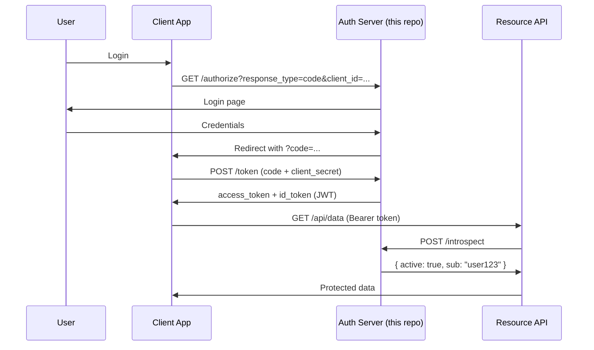

# OAuth2 / OpenID Connect SSO Provider — Node.js

<p align="center">
  
  
  
  
  
</p>

A reference implementation of an **OAuth 2.0 Authorization Server + OpenID Connect Provider** in Node.js. Demonstrates Authorization Code flow, token introspection, and SSO for multiple client applications.

---

## 🔐 Supported Flows

| Flow | Use Case |
|------|----------|
| Authorization Code | Web apps (server-side) |
| Authorization Code + PKCE | SPAs, Mobile apps |
| Client Credentials | Machine-to-machine |

---

## 🏗️ Architecture



---

## 🚀 Quick Start

```bash
npm install
cp .env.example .env
npm start
```

### Key endpoints

| Endpoint | Description |
|----------|-------------|
| `GET /authorize` | Start OAuth2 flow |
| `POST /token` | Exchange code for tokens |
| `GET /userinfo` | OIDC user profile (Bearer) |
| `POST /introspect` | Token validation |
| `GET /.well-known/openid-configuration` | Discovery document |

---

## ⚙️ Configuration

```env
PORT=3000
JWT_SECRET=your-signing-secret
JWT_EXPIRY=1h
CLIENT_ID=demo-client
CLIENT_SECRET=demo-secret
REDIRECT_URI=http://localhost:4000/callback
```

---

## 📄 License

MIT
